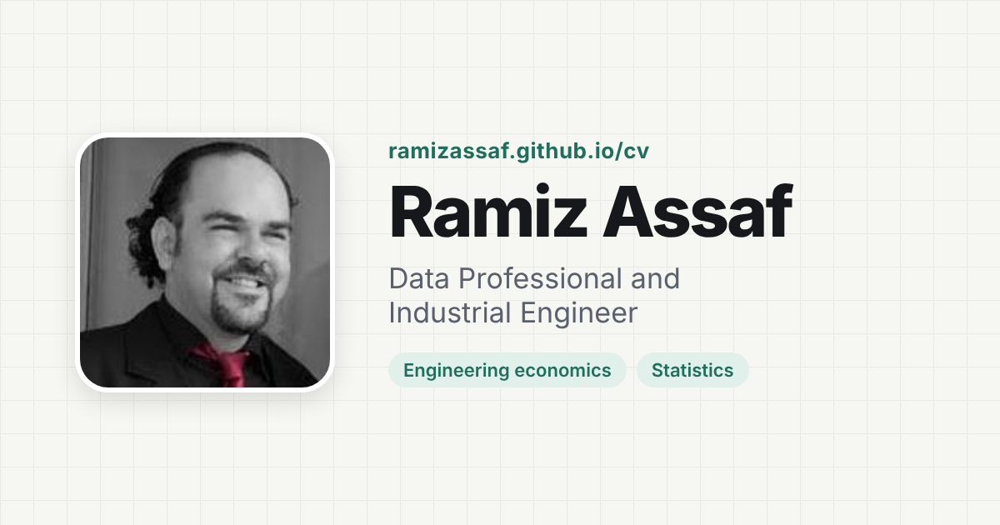

# Ramiz Assaf | Interactive CV

Personal CV website of Ramiz Assaf, Data Professional and Industrial Engineer based in Nablus, Palestine.

**Live site:** https://ramizassaf.github.io/ramizassaf



## Features

- **App layout.** A home screen of boxes. Each box opens a section, with a bottom navigation bar and a back button. Links like `#research` open a section directly.
- **ATS CV download.** "Download CV (PDF)" turns the Markdown CV into a clean, text-based PDF that applicant tracking systems read. The `.md` version is one click away.
- **Courses I teach.** 11 courses in three groups.
- **Slides about me.** One click generates a 14-slide HTML deck from the same data. Arrow keys to move, F for full screen, Save to keep a copy.
- **Services.** Training, online teaching, consulting, research collaboration, and more, each with a request button that fills the contact form.
- **Interactive teaching.** Dynamic HTML lecture slides (`slides/`) and three learning games (`games/`).
- **Social sidebar.** LinkedIn, Google Scholar, YouTube, GitHub, DataCamp, and email.
- **DataCamp learning.** 30 completed courses in the Skills section, grouped by tool.
- **Research dashboard, thesis supervision, certificates, and course reviews.**
- **Live demos.** A break-even calculator and a normal CDF approximation, in a pop-up window.
- **English and Arabic, light and dark.** Theme matches the IE Program Guide site.
- **No build step.** One HTML file, no frameworks.

## Files

| File | Purpose |
| --- | --- |
| `index.html` | The whole site: content, styles, and scripts |
| `og.png` | 1200 × 630 link preview image |
| `vendor/jspdf.umd.min.js` | jsPDF 2.5.1 (MIT), builds the PDF CV in the browser |
| `LICENSE` | MIT license for the code |

## Edit the content

All content lives in `index.html`.

- **Experience, education, certificates, publications, theses:** edit the `EXP`, `EDU`, `CERTS`, `PUBS`, and `THESES` lists in the script. The CV download, slides, and dashboard update from these lists.
- **Projects:** edit the `<article class="card proj">` blocks in the `#projects` section.
- **Arabic text:** each element with `data-i18n="key"` has an Arabic version under the same key in the `AR` object inside the script.
- **Contact form:** create a free form at [formspree.io](https://formspree.io) and paste its ID into `FORMSPREE_ID` near the top of the script. While the ID stays empty, the form opens the visitor's email app.

## Run locally

Open `index.html` in a browser, or serve the folder:

```bash
python3 -m http.server 8000
```

Then visit http://localhost:8000.

## Deploy

GitHub Pages serves the site from the `main` branch root. Every push to `main` updates the live site within 1 to 2 minutes.

## Related projects

- [Normal CDF Piecewise-Linear Approximation](https://github.com/ramizassaf/normal-cdf-piecewise-linear)
- [Break-Even Location Finder](https://github.com/ramizassaf/break-even-location-finder)
- [Engineering Economy Analysis](https://github.com/ramizassaf/Engineering-Economy)

## Contact

- Email: ramizassaf@gmail.com
- GitHub: [@ramizassaf](https://github.com/ramizassaf)

## License

Code released under the [MIT License](LICENSE). CV content and photo © Ramiz Assaf.
